Getting started with Kubeflow Notebooks and OpenM++.	2

Getting started with Kubeflow Notebooks and OpenM++.
This document is intended to act as an introduction to The AAWs Kubeflow Notebook servers and their use for the OpenM++ project.

Starting
To access the AAW Kubeflow portal, navigate to the following website.
https://kubeflow.aaw-dev.cloud.statcan.ca/  (Net B)
This will redirect you to a Microsoft log-in page.
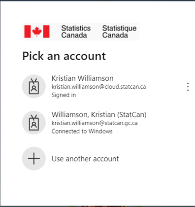

Select the account you wish to use and proceed with the authentication.
After your credentials are authenticated, you will be redirected to the AAW Kubeflow management panel. 
The Kubeflow management panel

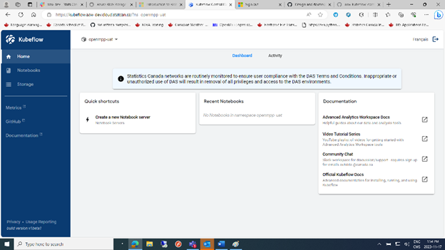

First things first, ensure a namespace is selected.
Create a notebook.
Click on the Create a New Notebook server button.

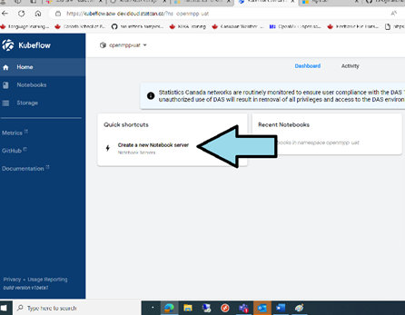

This brings up the new Notebook screen.

NewNBScreen01
Again, ensure the correct Namespace is selected, and a unique name is provided in the Name field, then click on the Notebook type you want.  For OpenM++, select the JupyterLab wafer.  For a discussion of what the other options can be used for, see section XXXX.
Scroll down to see the Launch Button.  The Launch button will only be active after the Namespace, the Notebook Name and a notebook type are selected.
 
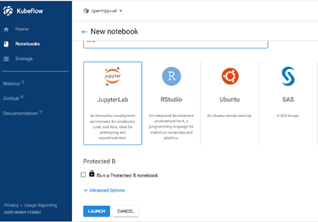
Advanced options are covered in Section ZZZZ.  You should not normally need to open this option.
Press the Launch button to launch you new Notebook.

Existing Notebooks
If you have previously created a notebook, you can click on the Notebooks Tab.

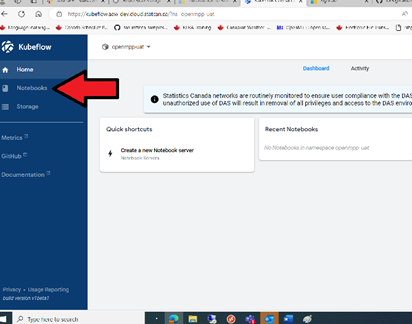

This will bring up a window with all your existing Notebooks.  You can manage them here.  
See section XXXX for instructions on how to delete resources.

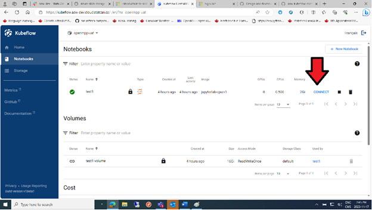
To start an existing Notebook, select it and press the CONNECT button.

Your Kubeflow notebook.

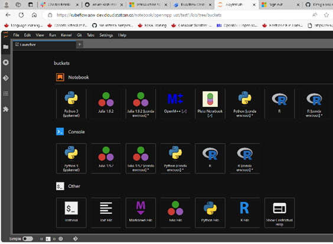

Initial tasks after creating a Notebook.
If you have just created this Notebook, then you will need to set-up the Models directory.
Select the Folder icon by clicking on it.

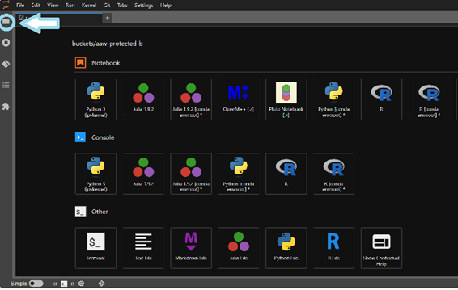

This will bring up the File explorer.

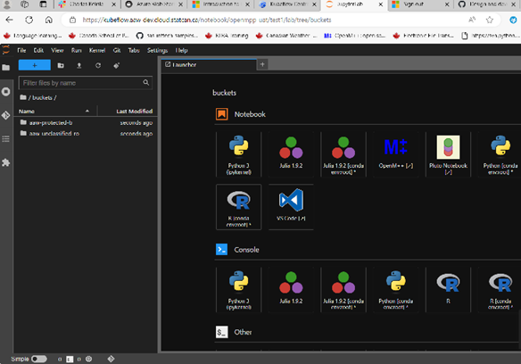
Note, the aaw-unclassified-ro folder is not an error. It allows a convenient place where unclassified data can be stored.  This folder is read-only (hence the ro ending) and is used to draw data from, not write to.
The Models directory must be placed directly under the bucket you are going to use.
For example, if your model uses protected-b classified data, then it must be created under the            aaw-protected-b bucket folder.

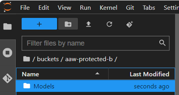
Otherwise, it can be created under the unclassified bucket folder.
The OpenM++ Models directory must be created at this location so that OpenM++ can find and run the models.

You can create sub-folders inside the Models folder to represent different project and upload files to them as needed.  Click on the New Folder icon to create a folder in the desired location.

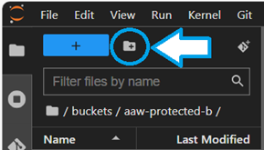

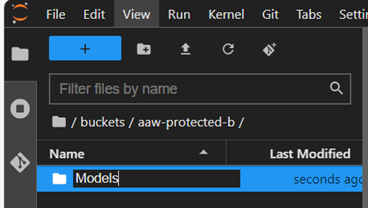

Select the directory you want to upload files to and select the File upload option

This will bring up a file explorer window where you can select the files you want to upload.

KFNoteBook08.png)

To start the OpemM++ UI, simply click on the OpenM++ icon on the Notebooks page.

OpenM++ UI
This will open a new window with the OpenM++ UI running.

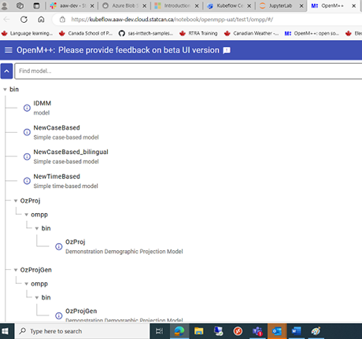

Click on the Ellipses symbol on the upper Left corner to change language.

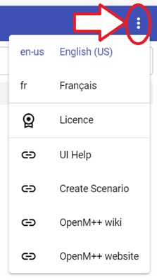

Click on the Hamburger Menu on the top right to open the sidebar.

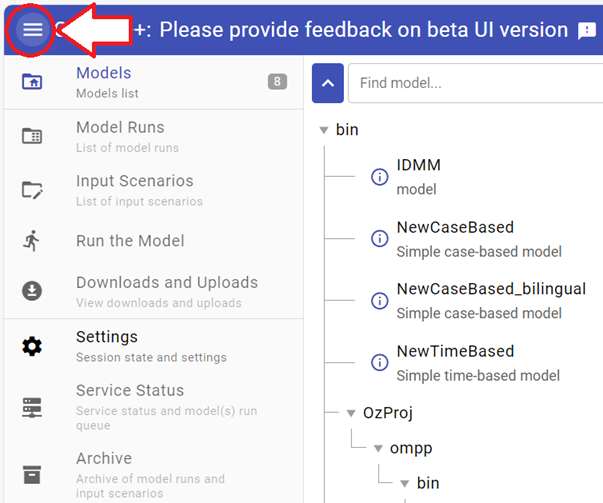

Click on the Model you want (Left Panel) to select it, In this case the IDMM Model.  This brings up the Model Run Panel and activates the Input Scenarios and Run the Model tabs on the Right Panel.

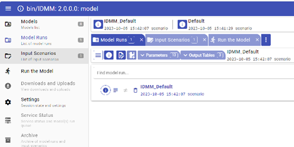
The horizontal tabs are also active (but greyed out) at this time.

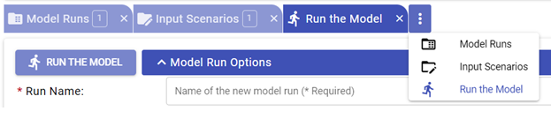

To Run a Model, first the Model name must be entered.  Simply clicking in the Model Name box will generate a uniquely timestamped Model name for the run.

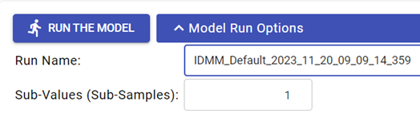
You can then click the Run the Model to run the job.

This brings up the Model Run Results Panel which shows the results of the run.

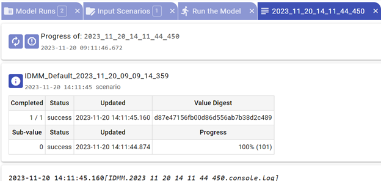
